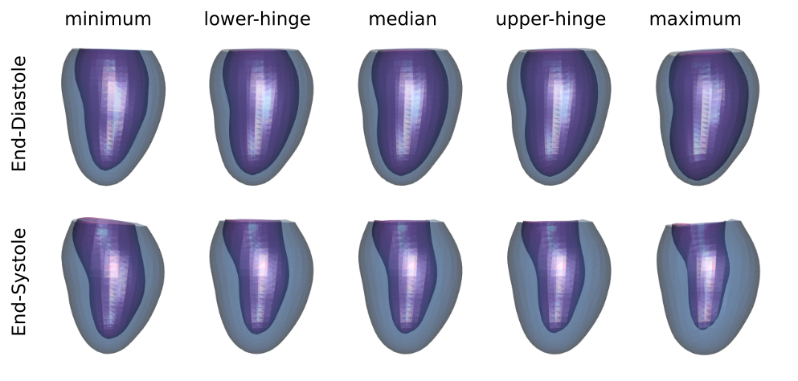

This project stores R codes to generate orthogonal basis vectors from a set of 3D Left Ventricular (LV) shapes. Each basis vector is aligned to the direction of maximum variance from a clinical measurement.

More information see: http://www.cardiacatlas.org/tools/lv-shape-orthogonal-clinical-modes/

## Generating the modes

There are two sets of LV shapes in the `data` folder. Example below shows how to generate the orthogonal clinical remodelling modes using ASYMPTOMATIC LV shapes.


```r
library(dplyr)
source('generate.ortho.modes.R')

# read the data, this will load X.ASYMP variable
load('data/surface_points_ASYMP.RData')

# read the clinical variables, select only ASYMP shapes
CI = read.csv('data/clinical_index.csv', header=TRUE) %>%
  filter(Group=="ASYMP") %>%
  select(EDVI,Sphericity,EF,RWT,Conicity,LS)
  
# compute modes with number of component = 1
ortho = generate.ortho.modes(X.ASYMP, CI, M=1)
```

The output `ortho` is a list that contains:
* `modes`, which are are the orthogonal basis vectors
* `scores`, which are the projections of the data to the basis vectors

We can verify if the modes are orthogonal

```r
as.data.frame(t(ortho$modes) %*% ortho$modes)
```

              EDVI   Sphericity   EF   RWT   Conicity   LS
-----------  -----  -----------  ---  ----  ---------  ---
EDVI             1            0    0     0          0    0
Sphericity       0            1    0     0          0    0
EF               0            0    1     0          0    0
RWT              0            0    0     1          0    0
Conicity         0            0    0     0          1    0
LS               0            0    0     0          0    1

## Modes of shape variation

A *mode of shape variation* is a visualization of a shape that is generated from a model by using only one mode. If there are $K$ modes, the $i$-th mode of shape variation is given by:
$$
x = \bar{x} + \lambda_i \mathbf{B}_i
$$
where $\bar{x}$ is a *mean shape*, $\mathbf{B}_i$ is the $i$-th column of the mode matrix and $\lambda_i$ is a constant. The value of $\lambda_i$ is usually computed from the distribution of $i$-th scores.

For example, if we want to visualize the Tukey's five number summaries (minimum, lower-hinge, median, upper-hinge, and maximum) from the Ejection Fraction (EF) mode, then

```r
source('plot.shape.R')

# compute the mean shape
mean.shape = colMeans(X.ASYMP)

# compute the lambda coefficients - use R's fivenum function
lambdas = fivenum(ortho$scores[,"EF"]) - mean(ortho$scores[,"EF"])

# generate the modes of EF shape variations
S = matrix(1, nrow=length(lambdas), ncol=1) %*% mean.shape + 
  matrix(lambdas, ncol=1) %*% matrix(ortho$modes[,"EF"],nrow=1)
```

Plotting the modes

```r
# get points for ED and ES surfaces
pts.ed = 1:(length(mean.shape)/2)
pts.es = (1+length(mean.shape)/2):length(mean.shape)

# plot it with rgl library
library(rgl)

mfrow3d(2, length(lambdas), sharedMouse = TRUE, byrow = FALSE)
for( i in 1:length(lambdas) ) 
{
  plot.shape(S[i, pts.ed], new.plot = FALSE)
  next3d()
  plot.shape(S[i, pts.es], new.plot = FALSE)
  if( i < length(lambdas) ) { next3d() }
}
rglwidget()
```


